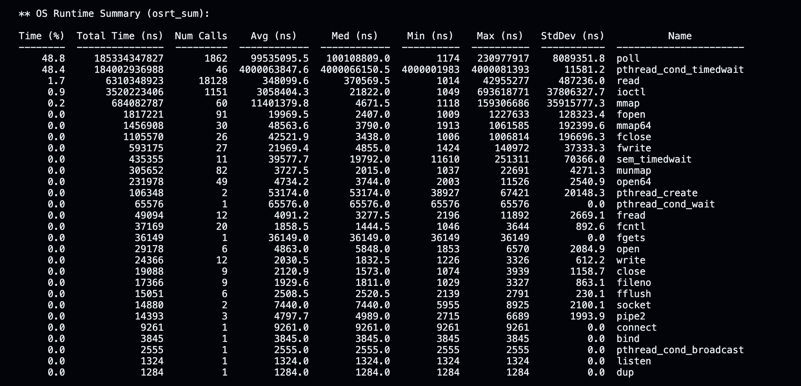
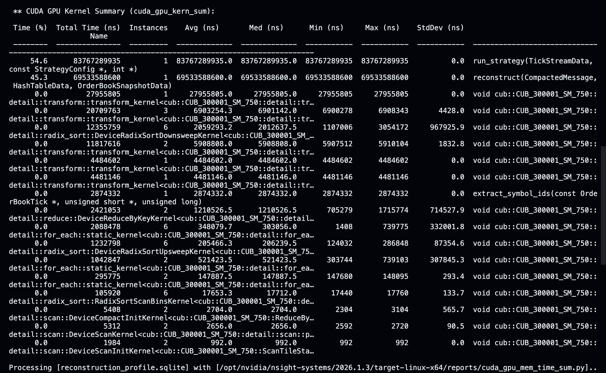
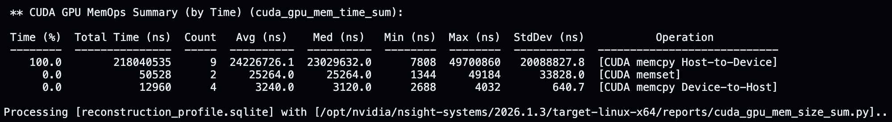
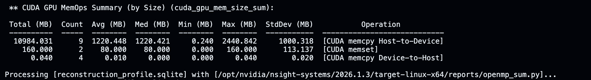

# CUDA Orderbook
This README was written by a human.

## CUDA Orderbook Reconstructor and Backtester

A GPU pipeline that parses raw NASDAQ TotalView ITCH 5.0 market data, reconstructs a live limit order book for every traded symbol, and sweeps 10,000 trading strategy configurations against the reconstructed book in parallel (using the GPU).

## Results

### Measurements

The following values come from testing on the 30/08/2019 NASDAQ TotalView-ITCH  5.0 file available at the [NASDAQ Public Archive](https://emi.nasdaq.com/ITCH/Nasdaq%20ITCH/). The entire project was run on an NVIDIA H100 SXM cloud instance on [Runpod.io](https://www.runpod.io/)

- **305,105,310 messages** reconstructed in **69.5s** (**~4.4M msgs/sec**)
- **10,000 configs** backtested in **83.8s**

#### Nsight Systems Profile

- OS Runtime Summary



- CUDA GPU Kernel Summary



- CUDA GPU MemOps Summary (by Time)



- CUDA GPU MemOps Summary (by Size)



Unfortunately, the GPU cloud instance does not support NVIDIA Nsight Compute `ncu`. This is common on most rented GPU containers due to driver security restrictions; an `ncu` analysis was thus ommitted.

## Build

Clone the repo and compile with
```bash
make bin/itch_parser
```
If you have a NASDAQ Itch file on disc, execute the binary with

```bash
./bin/itch_parser path_to_file
```

The CUDA paths in the Makefile are specific to the GPU cloud instance. You may have to change it to match your system.

## Languages and Tooling
C++ was used for code on the host (CPU) while CUDA C++ was used for everything on the device (GPU).  CUB was used for radix sort and run-length-encoding used for compaction. Thrust was used to facilitate this.

## Directory Layout

## Pipeline

### Parsing the ITCH Feed
An average ITCH file can be >= 10 GB. Thus loading the entire file at once into memory, before starting any of the reconstructing and backtesting, can cause a severe bottleneck. Thus, A custom `ItchReader` class and `ItchDecoder` namespace was created to parse ITCH files. `ItchReader` keeps a fixed-size pinned buffer (set to 1 MB in `main.cu` to read chunks from the file, `ItchDecoder` decodes messages out of this window, and the buffer gets refilled as it is consumed. `ItchDecoder` decodes the message and stores its data into a struct of arrays (SoA) format, in order to keep data contiguous for the GPU. 

Parsing then runs two full passes over the file. The first counts the number of messages so that we can allocate the right amount of memory for our `SoA` once, as opposed to growing and reallocating pinned memory repeatedly as messages come in. The second pass then decodes each message, adds its data into our `SoA`. For simplicity, only the following message types were handled:
- Add
- Execute
- Execute With Price
- Cancel
- Delete
- Replace

We return a `std::optional<DecodedOrder>` for message types not handled.

NASDAQ's sample files prefix every message with a 2-byte big-endian length field, which is not a part of the ITCH spec as this field is a property of how the sample archive packages messages for download, and not the ITCH protocol itself. Thus, `ItchReader` takes a `length_prefix_size` constructor argument for this, reads and skips that many bytes before the type byte, and cross-checks the resulting length against what the ITCH spec. A mismatch throws immediately with the exact byte position.

### GPU Hash Table


### Compacting by Symbols

### Reconstruction

### Backtesting

## Design Choices


## Challenges

## Limitations

## Future Work

